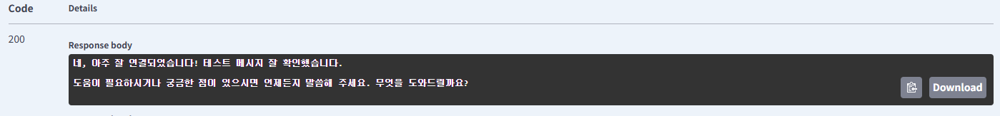

# Spring AI란?
- Spring 생태계에서 AI 및 LLM 을 쉽게 활용할 수 있도록 지원하는 프레임워크

## Spring AI의 주요 특징
- LLM (GPT-4, Gemini, LLaMA 등) 지원
- Prompt Management (프롬프트 관리)
- RAG (Retrieval-Augmented Generation) 적용 가능
- Spring Boot와 자연스럽게 통합
- Vector DB (Pinecone, FAISS) 연동 가능
- 서버리스 AI API (OpenAI, Hugging Face) 연동 가능

# Spring AI 환경 설정
- Spring Boot 3.x 버전 이상에서 사용 가능

## 의존성 설치
```gradle
// Spring AI 전체 라이브러리들의 버전 정합성을 맞춰주는 기준표
dependencyManagement {
    imports {
        mavenBom "org.springframework.ai:spring-ai-bom:1.1.2"
    }
}
dependencies {
  // Spring AI 의존성
  implementation 'org.springframework.ai:spring-ai-starter-model-google-genai'
}
```

## properties 설정
```properties
# Gemini API 설정
spring.ai.google.genai.api-key=YOUR_API_KEY
spring.ai.google.genai.project-id=YOUR_GCP_PROJECT_ID
# 모델 설정 AI버전, 창의성
spring.ai.google.genai.chat.options.model=gemini-3-flash-preview
spring.ai.google.genai.chat.options.temperature=0.7
```


>인터넷에서 찾아봤을때
>`spring.ai.google.ai.api-key` 로 api 키 설정을 해야한다고 했는데 자꾸 오류나서
>`spring.ai.google.genai.api-key` 로 바꿔서 해보니 오류없이 잘 작동됐다.
>
> 추가로 Spring Boot 3.5.8 버전 혹은 3.5.9를 사용한다면 Spring AI 1.1.2 버전을 사용하니 문제없이 실행되었다.

## Controller 설정
```java
@RestController
@RequestMapping("/ai")
public class AiController {
    private final ChatClient chatClient;

    public AiController(ChatClient.Builder builder) {
        this.chatClient = builder.build();
    }

    @GetMapping
    public String ask(@RequestParam String message) {
        return chatClient.prompt()
                .user(message)
                .call()
                .content();
    }
}
```




# 사용법

## 1. 스트리밍 답변 받기
ChatGPT처럼 글자가 한 자씩 타이핑되는 효과를 주고 싶을 때 사용합니다. `call()` 대신 `stream()`을 사용하면 됩니다.

```java
@GetMapping(value = "/stream", produces = MediaType.TEXT_EVENT_STREAM_VALUE)
public Flux<String> stream(@RequestParam String message) {
    return chatClient.prompt()
            .user(message)
            .stream() // 한 번에 받지 않고 데이터가 생성될 때마다 흘려보냄
            .content();
}
```
> 리턴 타입이 `Flux<String>`으로 바뀝니다. React에서는 이를 받아 화면에 누적해서 보여주면 됩니다.

## 2. 구조화된 데이터(JSON)로 받기

AI의 답변을 단순히 텍스트가 아니라 자바 객체(DTO)로 바로 변환해서 받을 수 있습니다. 데이터를 가공해서 DB에 넣거나 화면에 표로 보여줄 때 필수입니다.

응답받고 싶은 구조를 Record나 Class로 정의
```java
public record BookInfo(String title, String author, int year) {}

@GetMapping("/book")
public BookInfo getBookInfo(@RequestParam String bookName) {
    return chatClient.prompt()
            .user(bookName + "에 대한 정보를 알려줘")
            .call()
            .entity(BookInfo.class); // 답변을 자동으로 BookInfo 객체로 변환
}
```

## 3. 시스템 메시지(Persona) 설정하기

AI에게 "너는 10년 차 수능 전문가야" 같은 역할을 부여하여 답변의 품질을 높이는 방법입니다.

```java
@GetMapping("/expert")
public String expertAsk(@RequestParam String message) {
    return chatClient.prompt()
            .system("너는 학습 플래너 전문가야. 학생의 질문에 아주 친절하고 체계적으로 답변해줘.")
            .user(message)
            .call()
            .content();
}
```

## 4. 대화 요약 및 옵션 조절 (Temperature)

답변의 창의성(Temperature)을 조절하여 더 정확하거나, 더 창의적인 답변을 유도할 수 있습니다.

```java
public String creativeAsk(String message) {
    return chatClient.prompt()
            .user(message)
            .options(ChatOptionsBuilder.builder()
                .withTemperature(0.9f) // 0.0에 가까울수록 일관되고, 1.0에 가까울수록 창의적임
                .build())
            .call()
            .content();
}
```

# 예시
```java
String response = chatClient.prompt()           // 1. 요청 시작할게!
    .system("너는 훌륭한 요리사야.")             // 2. (옵션) 너의 정체성을 정해줄게
    .user("김치찌개 레시피 알려줘")              // 3. 내 질문은 이거야
    .options(ChatOptionsBuilder.builder()       // 4. 그리고...
        .withTemperature(0.5f)                  //    조금 진지하게 대답해주고
        .build())
    .call()                                     // 5. 이제 서버로 보내! ( 혹은 stream() )
    .content();                                 // 6. 결과물에서 글자만 뽑아줘 ( 혹은 entity(MyDto.class) )
```